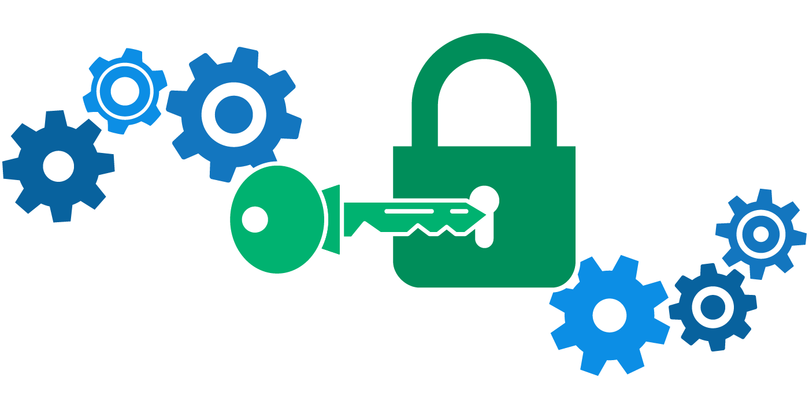

prueba script2

Básicamente la criptografía es la técnica que protege documentos y datos. Funciona a través de la utilización de cifras o códigos para escribir algo secreto en documentos y datos confidenciales que circulan en redes locales o en internet.

<!--truncate-->

## Objetivos de la seguridad informática
- Confidencialidad
- Autentificación
- Integridad
- No repudio

## Integridad
Existen programas (sfc en Windows, por ejemplo) que examinan la integridad de todos los archivos de sistema protegidos de Windows y reemplaza los que están corruptos o dañados. 

Comprobar los ficheros completamente es computacionalmente muy caro. Se utilizan funciones de dispersión H con las que se obtiene un resumen del fichero de tamaño fijo H(m).

Algoritmos para la función de dispersión:
- MD5
- SHA-1
  
Con el comando **sha256sum** podemos ponerle un código a un fichero para verificar que ese fichero es siempre el mismo:

~~~
$ sha256sum buster.vmdk
83bd9d3bb52b51b73fb24cdcaac0f969779c7f95db11479eeca4c67c4f5bb627  buster.vmdk
~~~

Por medio de las funciones de dispersión podemos comprobar, por ejemplo, si un fihcero descagado está corrupto.

## Firma digital
Quiero mandar un mensaje, pero comoprobar la integridad (es decir, que no ha sido cambiado por otro) y no poder repudiarlo, para esto último se usa la firma digital. El mensaje lo encriptamos con nuestra clave privada. De esta forma, el destinatario para descifrarlo necesita nuestra clave pública. 

Además, el receptor está seguro de que el mensaje es de la persona que dice ser y que es el documento que se quiso enviar, porque si fuera otro, el código cambia y no se puede desencriptar. 

El proble de esto es que cifrar de forma simétrica un documento es muy lento y costoso. Contra esto se firma el HASH, que es más rápido. Lo que pasa que de esta forma no se encripta el mensaje sino que se envía el mensaje al completo, se saca el HASH del documento, se firma (y encripta) el HASH, y se envía junto con el mensaje.

El receptor recibe el mensaje, que se ve, y el HASH encriptado. Con el mensaje y el HASH del mensaje se desencripta.

Opciones que tenemos para enviar la firam digital:
- Si el receptor ya tiene el documento original, solo mandamos la firma digital. Generamos la firma con la opción

~~~
gpg --detach-sign
~~~

- Podemos mandar el fichero original y la firma por separado. Usando la misma opción que en el caso anterior.

- Podemos mandar un solo fichero con el documento original y la firma. Generamos este fichero con una de las siguientes opciones:

~~~
gpg --sign
gpg --clearsign
~~~

## Validación de la clave pública
Una huella digital de la clave pública es el HASH de la clave pública. Cuando hacemos un gpg --list-key aparece las huellas digitales de las keys que tenemos. 

Una huella digital de clave pública, en la criptografía de clave, es una secuencia de bytes utilizada para identificar una clave pública más larga. Las huellas digitales se crean al aplicar una función de cifrado hash a una clave pública. 

Si tenemos la clave pública de una persona y queremos asegurarnos de que esa clave es de la persona que creemos que es, lo que se hace es firmar la clave pública con la privada. De esta forma, confiamos en la persona que corresponde. Pero además, si una tercera persona confía en mí, también va a confiar en la primera. 

[Si quieres saber mas funciones de GPG](https://elbauldelprogramador.com/chuleta-de-comandos-para-gpg/)
